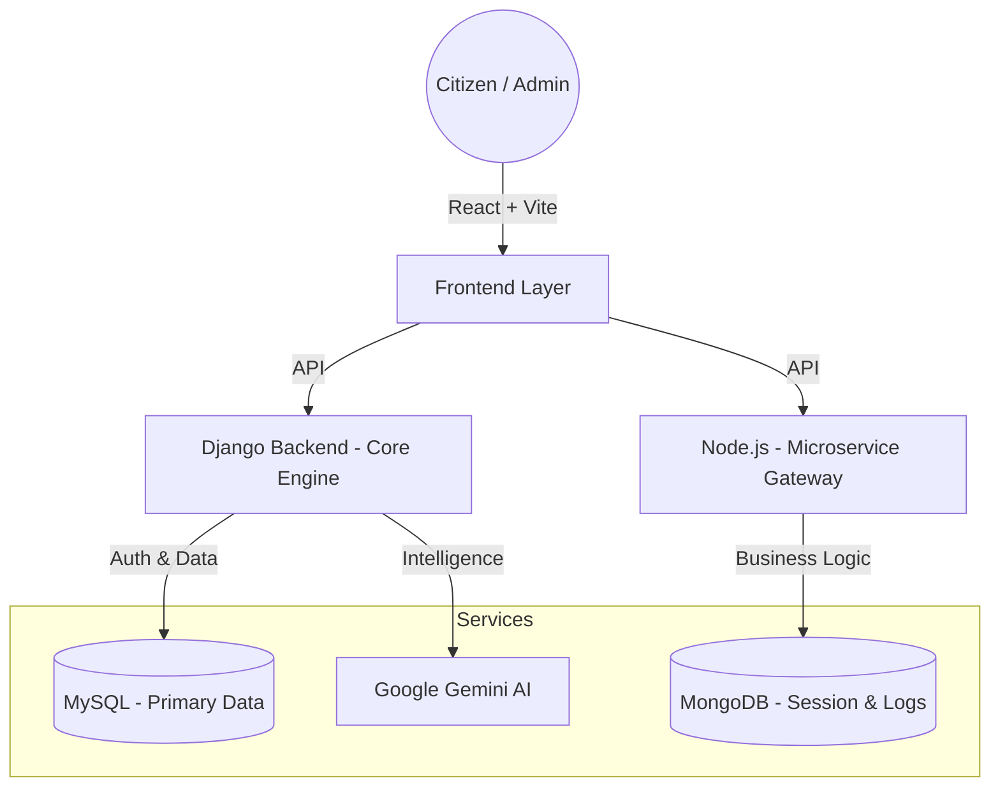

# Smart Beneficiary Mapping System (SBMS) 🚀

<div align="center">
  
  
  
  
</div>

---

## 🌍 Mission Statement
SBMS is an intelligent, high-impact platform designed to bridge the gap between government/social welfare schemes and the individuals who need them most. By leveraging Generative AI and a robust rules-based engine, we automate the discovery, eligibility mapping, and grievance handling for millions of beneficiaries.

### *“Empowering citizens through intelligent technology.”*

---

## 🌟 High-Impact Features

### 🤖 1. BENE-Bot: AI Welfare Assistant
An advanced AI companion powered by **Google Gemini**. It provides:
- **Persistent Chat Context:** Remembers user interactions for seamless assistance.
- **Contextual Awareness:** Direct mapping of user queries to specific welfare policies.
- **Natural Language Resolution:** Simplifies complex government jargon for the common citizen.

### 🧠 2. Intelligent Eligibility Mapping
A sophisticated rules engine that analyzes:
- **Demographics:** Age, location, occupational status.
- **Socio-Economic Data:** Income levels, family size, and asset ownership.
- **Real-time Discovery:** Instantly matches profiles against thousands of scheme criteria.

### ⚖️ 3. Smart Grievance Intelligence
Automated handling of citizen complaints using:
- **Sentiment Analysis:** Prioritizes issues based on user emotional tone and urgency.
- **Category Classification:** Automatically routes grievances to the relevant department.
- **Transparent Tracking:** End-to-end lifecycle management of citizen issues.

---

## 🏗️ Technical Architecture

The system utilizes a polyglot microservice architecture designed for scalability and resilience.



---

## 🛠️ Modern Tech Stack

| Layer | Technologies |
| :--- | :--- |
| **Frontend** |     |
| **Backends** |    |
| **AI / Data** |     |

---

## 🚀 Pro Installation Guide

### 1. Clone & Initialize
```bash
git clone https://github.com/navisjoshvadonel/Smart-beneficiary-mappping-system.git
cd Smart-beneficiary-mappping-system
```

### 2. Core Backend (Django)
```bash
cd sbms_project
pip install -r requirements.txt
# Configure .env with DB credentials and GEMINI_API_KEY
python manage.py migrate
python manage.py runserver
```

### 3. Microservice Gateway (Node.js)
```bash
cd ../sbms_nodejs_backend
npm install
# Configure .env with MONGO_URI
npm start
```

### 4. High-Performance Frontend (React)
```bash
cd ../sbms_frontend
npm install
npm run dev
```

---

## 📂 Project Roadmap
- [ ] **Phase 4:** Mobile App implementation (React Native).
- [ ] **Phase 5:** Blockchain integration for transparent fund disbursement.
- [ ] **Phase 6:** Multilingual support for localized schemes.

## 📄 License
This project is licensed under the MIT License - see the [LICENSE](LICENSE) file for details.

---
<p align="center">Made with ❤️ for social impact.</p>
